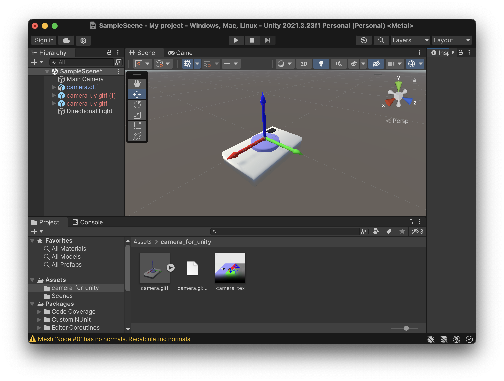

# 空間を扱うプログラミング - チュートリアル -

## 環境セットアップ

### Mac・Linux

1. asdf と asdf の python plugin をインストール
   * [asdf インストール](https://asdf-vm.com/guide/getting-started.html)
   * `asdf plugin add python`
2. python をインストール
   * `asdf install`
3. poetry をインストール ([公式ドキュメント](https://python-poetry.org/docs/#installing-with-the-official-installer))
   * `curl -sSL https://install.python-poetry.org | python -`
4. poetry (`$HOME/.local/bin/poetry`) へのパスを通す
   * zsh の場合
     * `echo 'export PATH=$HOME/.local/bin:$HOME' >> ~/.zshrc`
     * `source ~/.zshrc`
     * `poetry --version` (確認)
5. 仮想環境がリポジトリ内の `.venv/` に作られるようにする
   * `poetry config --local virtualenvs.in-project true`
6. `.tool-versions` に定義された python のバージョンを使って仮想環境をアクティベート
   * `poetry env use "$(cat ./.tool-versions | grep "python" | cut -d " " -f 2)"`
   * asdf で複数の python をインストールしている場合でも期待したバージョンが使われるようにするため
7. リポジトリの依存パッケージをインストール
   * `poetry install`

### Windows

※ ターミナルとして PowerShell の使用を前提とする。

1. pyenv のインストール
2. python をインストール
   * `$pythonVersion = Get-Content ./.tool-versions |  Select-String -Pattern "python" | ForEach-Object {$($_-split(" "))[1]}`
   * `pyenv install $pythonVersion`
3. poetry をインストール
4. poetry へのパスを通す
5. 仮想環境がリポジトリ内の `.venv/` に作られるようにする
6. `.python-version` に定義された python のバージョンを使って仮想環境をアクティベート
   * `$pythonVersion = Get-Content ./.tool-versions |  Select-String -Pattern "python" | ForEach-Object {$($_-split(" "))[1]}`
   * `pyenv exec poetry env use $pythonVersion`
7. リポジトリの依存パッケージをインストール
   * `poetry install`

## テキストブック (Jupyter notebook) の使用

1. `poetry run jupyter lab`
2. Web ブラウザで [http://localhost:8888/lab](http://localhost:8888/lab) にアクセス
3. `1_coordinate_system.ipynb` を開く

別の方法として、`Jupyter` extension をインストールした VSCode 上で notebook を開いても良い

* その場合、Jupyter kernel として poetry で作った仮想環境の python を設定すること

## コントリビューター向け情報

### camera モデルの作成

1. ツールセットアップ
   * [MeshLab](https://www.meshlab.net/) を使用するので最新版をインストール
2. PLY (頂点ごとに色を持つ) と GLTF (mesh) 形式でモデルを出力
   * `poetry run python scripts/create_camera_obj.py ply`
   * `poetry run python scripts/create_camera_obj.py gltf`
   * 生成したモデルは [`data`](data/) ディレクトリに出力される
3. 生成した `PLY` と `GLTF` モデルの両方を MeshLab にインポートする
4. MeshLab でメッシュテクスチャを生成
   * `GLTF` モデルを選択
     * ツールバーの `Filter` > `Texture` > `Parameterization: Trivial Per-Triangle` を選択
     * ポップアップウィンドウ上の設定はデフォルトのまま `Apply`
   * ツールバーの `Filter` > `Texture` > `Transfer: Vertex Attribute to Texture (1 or 2 meshes)` を選択
     * `Source Mesh` を `PLY` モデルとする
     * `Target Mesh` を `GLTF` モデルとする
   * 結果として `GLTF` モデルに `PNG` 形式のテクスチャが紐づく
5. モデルを `OBJ` 形式でエクスポートする
   * ツールバーの `File` > `Export Mesh as` を選択
   * ファイルフォーマットを `Alias Wavefront Object (OBJ)` とする
   * 結果として下記のファイル群が生成される
     * メッシュマテリアルの `.obj` ファイル
     * マテリアルに関する `.mtl` ファイル
     * テクスチャの `.png` ファイル

* 上記で生成したカメラの OBJ モデルは、Unity asset としてインポート可能
  * 下記のような見た目になる
    

### ソースツリー

チュートリアルでは Open3D の TriangleMesh や ViewControl を簡単に操作できるようなラッパーを使用している。
それらは [`util_lib/`](./util_lib/) に定義してある。

* [`camera.py`](./util_lib/camera.py)
  * カメラモデルを実装している
  * カメラモデルは `ICamera` インターフェースを実装する必要がある
    * 内部パラメータを保持し、必要に応じてカメラ行列が得られるようにしている
    * ワールド座標での transformation から外部パラメータを得られるようにしている
* [`transformable_object.py`](./util_lib/transformable_object.py)
  * Open3D の TriangleMesh クラスのラッパーである
  * オブジェクト本体の並進や回転を行ったとき、ワールド座標での transformation を計算し保持する
  * transformation を含めたオブジェクトのコピーを可能としている
* [`types.py`](./util_lib/types.py)
  * 共通して使用する型を定義している
* [`visualization.py`](./util_lib/visualization.py)
  * Open3D の Visualizer のラッパーである
  * Open3D の Geometry をレンダリングする
  * オプションでカメラモデル (`ICamera` 実装) を受け取り、そのカメラを初期視点に設定する
* [`world.py`](./util_lib/world.py)
  * チュートリアル用の 3D 空間を定義
  * 座標軸や床面をデフォルトで配置している

### コーディング規約

* 共通
  * リモートへの push 前にフォーマッター・リンターを適用する
    * python script、Jupyter notebook では `ruff` を適用する
* Jupyter notebook
  * リモートへの push 前にコードセルのアウトプットを全て clear する
